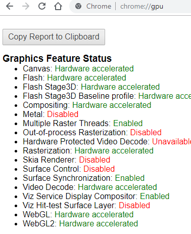
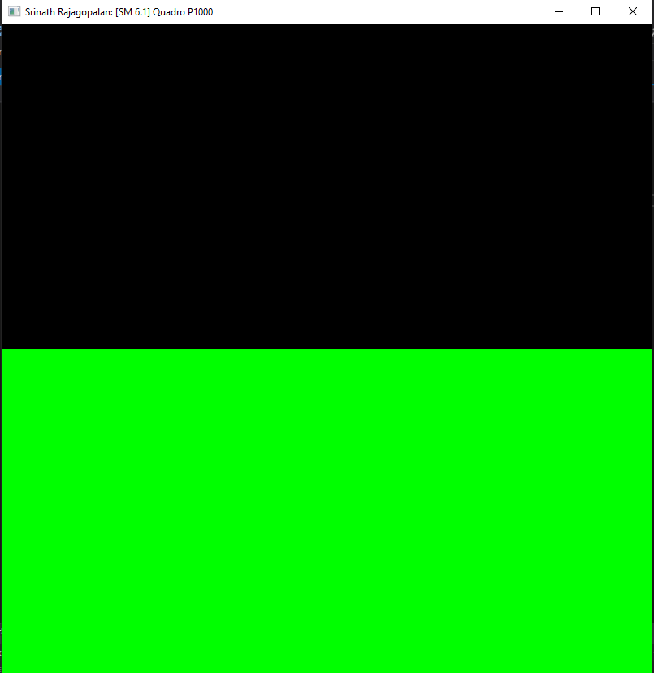
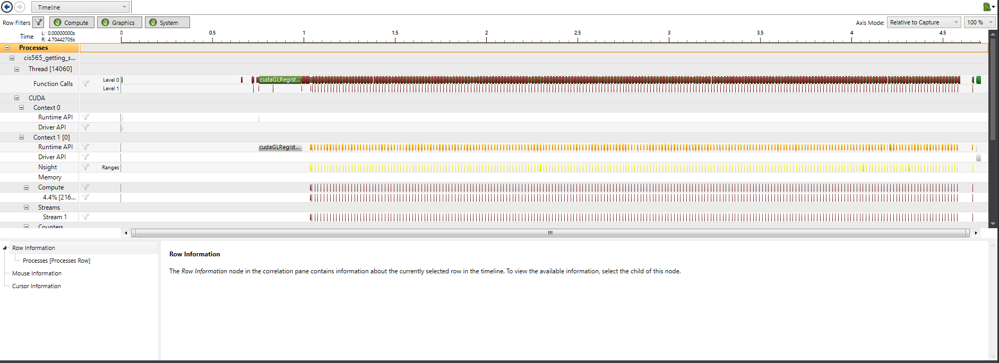
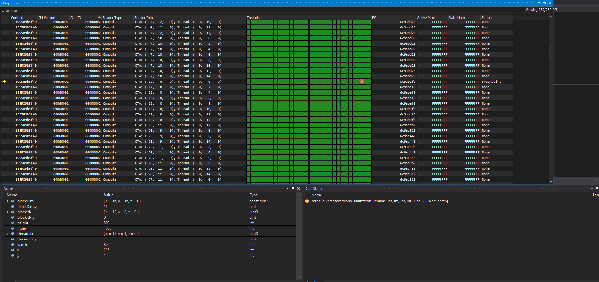

Project 0 Getting Started
====================

**University of Pennsylvania, CIS 565: GPU Programming and Architecture, Project 0**

* Srinath Rajagopalan
  * [LinkedIn](https://www.linkedin.com/in/srinath-rajagopalan-07a43155), [twitter](https://twitter.com/srinath132)
* Tested on: Windows 10, i7-6700 @ 3.4GHz 16GB, Nvidia Quadro P1000 4GB (Moore 100B Lab)

### (Readme)

### Part 2.2: WebGL

### Part 4: Modify

### Part 5: Analyze

### Part 6: Nsight Debugging

